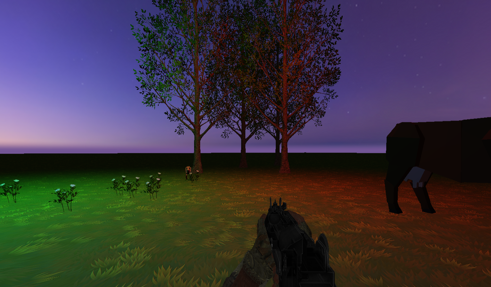
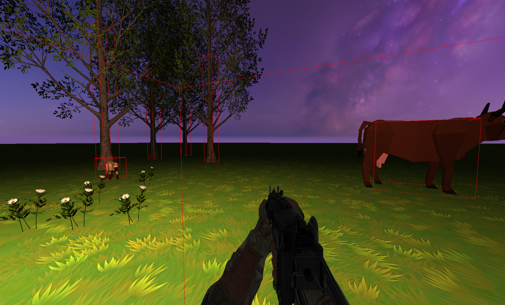
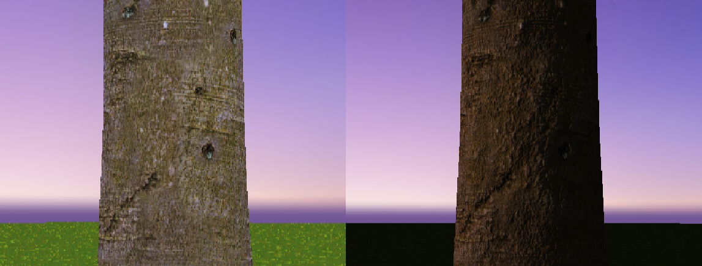
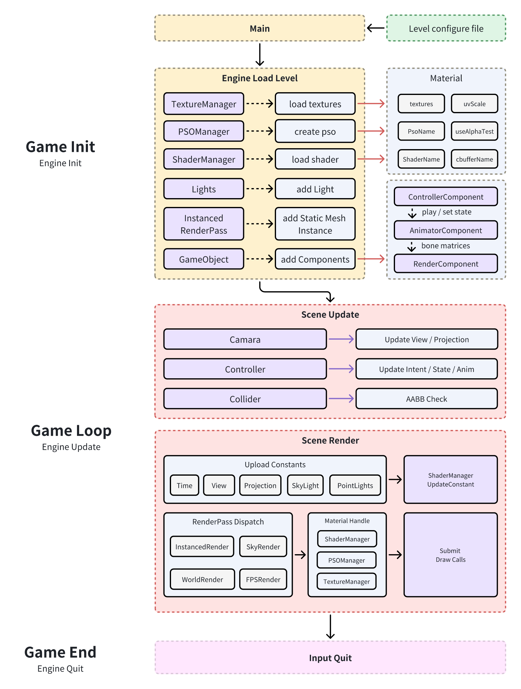

# DX12-FPS

A lightweight C++ / DirectX 12 game engine, demonstrated through an interactive first-person shooter prototype. The project connects a custom rendering backend, data-driven scene loading, resource management, and component-based gameplay in one executable.

*Project capture from the coursework report: the FPS demo running on the custom renderer.*

## Features

Developed as a Games Engineering coursework project, using the supplied GamesEngineeringBase library and external scene assets.

- **Rendering backend:** swap chain, color/depth targets, descriptor management, root signatures, pipeline states, resource transitions, and per-frame command resources synchronized with fences.
- **Scene architecture:** composable input, camera, collision, animation, weapon, and rendering components; a component factory assembles objects from configuration.
- **Data-driven levels:** text configuration creates textures, shaders, materials, lights, objects, and static instances, reducing scene-specific hardcoding.
- **Resources and materials:** cached resources, material instances, and shader reflection for named constant-buffer updates and texture binding.
- **Animation and rendering:** skeletal sampling and interpolation, skinning matrices, normal mapping, alpha testing, point lights, and GPU instancing. Separate render layers organize the world, sky, and first-person weapon.
- **Playable validation:** first-person movement, AABB collision response, ray-based shooting, weapon animation/state transitions, and enemy hit/death feedback.

## Visual breakdown

*Debug geometry makes scene collision volumes visible.*

*Normal-mapping comparison from the project report.*

Engine lifecycle and architecture

## Build and run

1. On Windows, install the MSVC v143 C++ toolset and Windows SDK, with Desktop development with C++ support. A DirectX 12-capable GPU/driver is required.
2. Open `GE9M2.sln` in Visual Studio or an IDE that supports MSBuild projects.
3. Select **Release | x64** and build `GE9M2`. The x64 configurations use v143; the Win32 configurations currently reference v145, so use x64 for this guide.
4. Set the debugger working directory to `$(ProjectDir)` (`GE9M2/`). The demo loads `Src/Assets/Levels/level_demo.txt` and asset paths relative to this directory.
5. Launch the project. Keep the assets and shaders in their checked-in locations. Debug builds additionally request the D3D12 debug layer.

## Code guide

| Location | Responsibility |
| --- | --- |
| [`GE9M2/Src/main.cpp`](GE9M2/Src/main.cpp) | Window, engine, game composition, and main loop |
| [`GE9M2/Src/Engine/`](GE9M2/Src/Engine/) | Rendering, scene/component systems, resources, and foundation code |
| [`GE9M2/Src/Game/FPSGame.cpp`](GE9M2/Src/Game/FPSGame.cpp) | Demo setup and level entry point |
| [`GE9M2/Src/Game/Level/LevelLoader.cpp`](GE9M2/Src/Game/Level/LevelLoader.cpp) | Text-driven scene assembly |
| [`GE9M2/Src/Assets/Levels/`](GE9M2/Src/Assets/Levels/) | Level configuration |

## Scope and documentation

This is a focused engine prototype with an FPS validation scene, rather than a production editor or a finished commercial game. The technical emphasis is ownership, engine/game separation, GPU resource lifetime, and integration of rendering with gameplay.

See the [project report](WM9M2.pdf) for architecture, implementation details, and the original figures. README images were extracted from that report without changing the rendered results.
